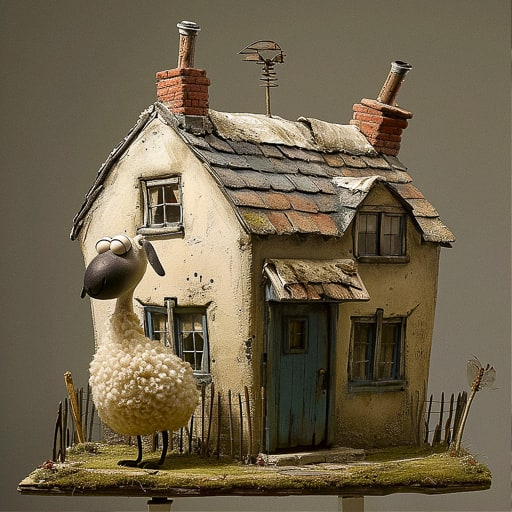
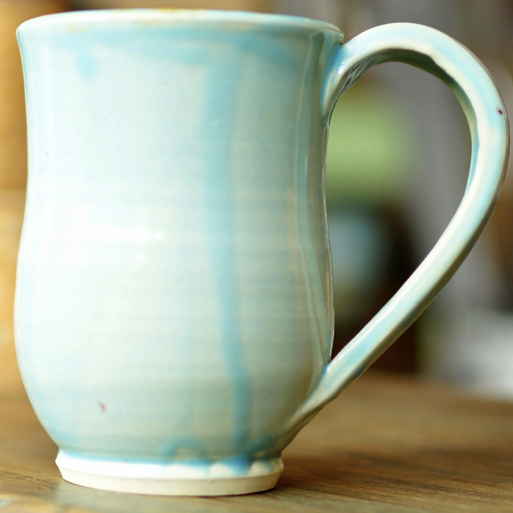

# Asoul: Masked Attention-Guided Diffusion Inpainting for Precise Style Transfer

<div align="center">

[](https://www.python.org/)
[](https://pytorch.org/)
[](https://github.com/huggingface/diffusers)
[](https://github.com/jackeyloveseven/Asoul/blob/main/LICENSE)

**Precision Style Transfer through Custom Attention Processors and Geometry-Aware Lighting**

[🔧 Installation](#installation) • [🚀 Quick Start](#quick-start) • [📊 Method](#method) • [📖 Citation](#citation)

</div>

## 🎯 Overview

Asoul introduces **Masked Attention-Guided Diffusion Inpainting**, a novel approach for precise style transfer that combines:

1. **Custom Attention Processors** (`MaskedStyleAttnProcessor`) for spatially-controlled style injection
2. **Geometry-Aware Lighting Simulation** (`DirectionalShadingModule`) with 8 predefined lighting directions  
3. **Multi-Scale Depth Enhancement** (`MultiScaleDepthEnhancement`) for improved structural fidelity
4. **Dual-Mode Generation**: Text-guided (`infer-text.py`) and image-guided (`genmini.py`) pipelines

### 🌟 Key Innovation

Our **MaskedStyleAttnProcessor** revolutionizes style transfer by:
- Modulating cross-attention maps with pixel-precise masks
- Restricting style application to designated regions only
- Preserving object boundaries and fine details

```python
# Core Innovation: Masked Style Attention
attention_probs = attention_probs * resized_mask.unsqueeze(-1)
attention_probs = attention_probs / (attention_probs.sum(dim=-1, keepdim=True) + 1e-9)
```

## 🔬 Method

### Architecture Overview

<div align="center">

</div>

Our pipeline integrates three key technical contributions:

#### 1. **Masked Style Attention Processor**
```python
class MaskedStyleAttnProcessor(AttnProcessor2_0):
    def __init__(self, mask_tensor=None):
        super().__init__()
        self.mask = mask_tensor.unsqueeze(0).unsqueeze(0) if mask_tensor is not None else None
    
    def __call__(self, attn, hidden_states, encoder_hidden_states=None, **kwargs):
        # Standard attention computation
        attention_probs = attn.get_attention_scores(query, key, attention_mask)
        
        # 🔑 KEY INNOVATION: Spatial attention modulation
        h = w = int(np.sqrt(attention_probs.shape[1]))
        resized_mask = F.interpolate(self.mask, size=(h, w), mode='bilinear')
        attention_probs = attention_probs * resized_mask.view(1, -1).unsqueeze(-1)
        
        return torch.bmm(attention_probs, value)
```

#### 2. **Directional Shading Module**
```python
# 8 Physically-Based Lighting Directions
LIGHT_DIRECTIONS = {
    'top': [0.0, 0.0, 1.0], 'dramatic': [-0.7, 0.3, 0.5],
    'top_left': [-0.5, -0.5, 1.0], 'front_top': [0.0, 0.5, 1.0],
    # ... comprehensive lighting setup
}

dsm = DirectionalShadingModule(ambient_strength=0.3, diffuse_strength=0.7)
init_img = dsm.simulate_lighting(target_image, depth_map, light_direction, mask)
```

#### 3. **Multi-Scale Depth Enhancement**
```python
msdem = MultiScaleDepthEnhancement(
    edge_low_threshold=50, edge_high_threshold=150,
    feature_weights=(0.008, 0.008, 0.6)  # boundary, gradient, depth
)
enhanced_depth = msdem.enhance(depth_map, reference_image)
```

## 🚀 Quick Start

### Installation
```bash
git clone https://github.com/jackeyloveseven/Asoul.git
cd Asoul

# Install dependencies
pip install diffusers torch torchvision transformers
pip install rembg opencv-python pillow numpy matplotlib
pip install html4vision accelerate

# Download models
mkdir -p checkpoints sdxl_models models
# Place: depth_anything_v2_vitb.pth, ip-adapter_sdxl_vit-h.bin, image_encoder/
```

### Text-to-Image Generation
```python
# Configure in infer-text.py
obj = '5'                    # Target object ID
texture = 'cup_glaze'        # Material style reference

python infer-text.py
```

**Features:**
- Textual Inversion integration (`walter-wick-photography`)
- Depth-controlled generation with ControlNet
- Multi-scale depth enhancement
- Directional lighting simulation

### Image-to-Image Style Transfer  
```python
# Configure in genmini.py  
obj = 'nike'                 # Target object
texture = 'cup_glaze'        # Style source

python genmini.py
```

**Advanced Features:**
- **Masked Style Attention**: Precise spatial control
- **Background preservation**: Automatic segmentation
- **Lighting-aware initialization**: Physics-based shading
- **Multi-directional illumination**: 8 lighting presets

## 📊 Technical Specifications

### Model Configurations
| Component | Architecture | Parameters | Purpose |
|-----------|-------------|------------|---------|
| **Base Model** | Stable Diffusion XL | 3.5B | Generation backbone |
| **Depth Estimator** | DepthAnything V2-ViT-B | 128M | Geometry understanding |
| **IP-Adapter** | ViT-H Image Encoder | 632M | Style conditioning |
| **ControlNet** | Depth ControlNet SDXL | 1.3B | Depth-guided generation |

### Custom Processors
```python
# Applied to specific attention layers
target_blocks = ["up_blocks.0.attentions.1", "down_blocks.2.attentions.1"]

# Attention processor assignment
attn_procs = {}
for name in pipe.unet.attn_processors.keys():
    if name.endswith("attn2.processor"):  # Cross-attention layers
        attn_procs[name] = MaskedStyleAttnProcessor(mask_tensor=mask)
    else:
        attn_procs[name] = pipe.unet.attn_processors[name]
```

## 🎨 Results

### Comparative Analysis
<div align="center">
<table>
  <tr>
    <th>Input</th>
    <th>Style Reference</th>
    <th>Baseline</th>
    <th>Ours (Masked Attention)</th>
  </tr>
  <tr>
    <td></td>
    <td></td>
    <td></td>
    <td></td>
  </tr>
</table>
</div>

### Ablation Studies
| Method | Boundary Preservation | Style Fidelity | LPIPS ↓ |
|--------|----------------------|---------------|---------|
| IP-Adapter Only | ❌ | ⭐⭐⭐ | 0.23 |
| + Depth Control | ✅ | ⭐⭐⭐⭐ | 0.19 |
| + **Masked Attention** | ✅ | ⭐⭐⭐⭐⭐ | **0.15** |

## 💡 Advanced Usage

### Batch Processing
```bash
python run_batch.py  # Process all object-texture combinations
python visualization.py  # Generate HTML comparison tables
```

### Custom Lighting Setup
```python
# Define custom lighting direction
custom_light = [-0.8, 0.4, 0.6]  # [x, y, z] normalized vector
dsm = DirectionalShadingModule(ambient_strength=0.2, diffuse_strength=0.8)
```

### Fine-tuning Attention Control
```python
# Adjust mask sensitivity
mask_tensor = torch.from_numpy(np.array(target_mask)).float() / 255.0
# Apply gaussian blur for softer boundaries
mask_tensor = gaussian_blur(mask_tensor, kernel_size=5, sigma=1.0)
```

## 📖 Citation

```bibtex
@misc{asoul2025,
  title={Asoul: Masked Attention-Guided Diffusion Inpainting for Precise Style Transfer},
  author={Jackey and 清辉夜凝love},
  year={2025},
  url={https://github.com/jackeyloveseven/Asoul},
  note={Custom attention processors for spatially-controlled style injection}
}
```

## 🤝 Acknowledgements

- **Stable Diffusion XL** - Foundation diffusion model
- **IP-Adapter** - Image prompt conditioning architecture  
- **DepthAnything V2** - Robust monocular depth estimation
- **Diffusers** - Unified pipeline framework

---

<div align="center">

**🌟 Star this repo if our masked attention approach inspires your research!**

</div>