# SynergyFrame: A Unified Framework for Photorealistic Local Stylization

<div align="center">

[](https://www.python.org/)
[](https://pytorch.org/)
[](https://github.com/huggingface/diffusers)
[](https://github.com/jackeyloveseven/SynergyFrame/blob/main/LICENSE)

**Synergizing Geometry, Lighting, and Style for High-Fidelity Texture Generation**

[🔧 Installation](#installation) • [🚀 Quick Start](#quick-start) • [🎯 Overview](#overview) • [🔬 Method](#method) • [📖 Citation](#citation)

</div>

## 🎯 Overview

The core mission of our work is to introduce **SynergyFrame**, a unified framework capable of generating high-fidelity, physically realistic textures. This framework is designed to synergize multiple control signals—specifically geometry, lighting, and style—to achieve seamless and detailed local stylization, thereby empowering and enhancing mainstream generative workflows.

### 💥 The Core Challenge: A Common Dilemma in Guided Generation

Existing workflows, while powerful, face significant challenges when guided by multiple, often conflicting, control signals:

- **`Inpainting` Workflows:** The strong structural and boundary constraints inherent to inpainting often **suppress the effective expression of style signals**. This leads to results where the stylization is either muted, coarse, or fails to integrate naturally.
- **`Image-to-Image` Workflows:** The creative freedom of these models is a double-edged sword. In unconstrained regions, they are prone to producing **checkerboard artifacts** or **style leakage**, which contaminates the original, unmasked content.

### ✨ The Solution: SynergyFrame

To address these challenges, we propose **SynergyFrame**, a universal solution built upon two foundational pillars that transform signal conflict into synergy.

```mermaid
graph TD
    subgraph "Inputs"
        A[Geometry]
        B[Lighting]
        C[Style]
        D[Mask]
    end

    subgraph "SynergyFrame Core"
        P1["Pillar 1: Physics-Prior Injection<br/>(MultiScaleDepth, DirectionalShading)"]
        P2["Pillar 2: Adaptive Semantic Fusion<br/>(Semantic Sparse Attention - SSA)"]
        A & B --> P1
        C & D --> P2
        P1 --> SR
        P2 --> SR
        SR{Synergized Representation}
    end

    subgraph "Empowered Workflows"
        W1[Inpainting]
        W2[Image-to-Image]
        SR --> W1 & W2
    end

    subgraph "Outputs"
        O1["✔️ High-Fidelity Results<br/>✔️ No Style Suppression"]
        O2["✔️ Artifact-Free<br/>✔️ No Style Leakage"]
        W1 --> O1
        W2 --> O2
    end
```

<details>
<summary>Click to see the SynergyFrame Architecture Diagram</summary>


</details>

*The SynergyFrame architecture, turning conflicting signals into a synergistic force for photorealistic stylization.*


## 🔬 Method: The Two Pillars of SynergyFrame

### Pillar 1: Physics-Prior Injection (The Foundation of Realism)
To ground our stylization in physical reality, we inject crucial environmental priors at the outset.
- **Multi-Scale Geometric Awareness:** The `MultiScaleDepthEnhancement` module provides the model with a comprehensive understanding of the scene's geometric structure across various scales.
- **Lighting-Aware Initialization:** The `DirectionalShadingModule` establishes a coherent lighting environment, ensuring that the generated style interacts harmoniously with shadows and highlights.

### Pillar 2: Adaptive Semantic Fusion (The Key to Universal Empowerment)
This pillar enables our framework to intelligently adapt to different workflows and resolve their core weaknesses.
- **Core Mechanism: Semantic Sparse Attention (SSA):** We introduce a plug-and-play **Semantic Sparse Attention** mechanism. SSA compels the model to perform precise semantic matching at the attention level, ensuring the style is applied only where it makes semantic sense.
- **Adaptive Capabilities:**
    - **For `Inpainting`:** SSA's strong semantic matching **breaks through inherent style suppression**, enabling fine-grained and accurate style injection even under strong structural constraints.
    - **For `Image-to-Image`:** When combined with a mask, SSA precisely **constrains the style's application area**, effectively preventing artifacts and content leakage.

## 🚀 Quick Start

### Installation
```bash
# 1. Clone the repository
git clone https://github.com/jackeyloveseven/SynergyFrame.git
cd SynergyFrame

# 2. Install dependencies (example)
# Create a requirements.txt file with your dependencies
# pip install -r requirements.txt
# Example dependencies:
pip install diffusers transformers torch torchvision
pip install accelerate opencv-python pillow numpy matplotlib
pip install rembg html4vision

# 3. Download models
mkdir -p checkpoints sdxl_models models
# Place required models in their respective directories:
# - checkpoints/depth_anything_v2_vitb.pth
# - models/ip-adapter_sdxl_vit-h.bin
# - models/image_encoder/
```
*Note: Please refer to the original model repositories for official download links.*

### Generation Pipelines
SynergyFrame enhances two primary workflows.

#### 1. Empowered Inpainting (Text-Guided)
This workflow leverages strong geometric and boundary constraints, now enhanced with powerful style injection via SSA.
```bash
# Example usage (please adapt to your actual script)
python infer-text.py \
    --object_id '5' \
    --texture_ref 'cup_glaze.png' \
    --prompt "a photo of a {object} with {style} texture"
```

#### 2. Empowered Image-to-Image (Style-Reference-Guided)
This workflow offers greater creative freedom, with SSA preventing style leakage and artifacts.
```bash
# Example usage (please adapt to your actual script)
python genmini.py \
    --object_name 'nike' \
    --style_ref 'cup_glaze.png'
```

## 📊 Results: From Conflict to Synergy

Our narrative focuses on **synergy**, not opposition. SynergyFrame is not about proving one workflow's superiority but about acting as a higher-level, unified control framework. It elevates both `Inpainting` and `Image-to-Image` to new heights in local stylization tasks.

### Comparative Analysis
<div align="center">
<table>
  <tr>
    <th>Input</th>
    <th>Style Reference</th>
    <th>Baseline (e.g., Inpainting)</th>
    <th>Ours (SynergyFrame)</th>
  </tr>
  <tr>
    <td></td>
    <td></td>
    <td></td>
    <td></td>
  </tr>
</table>
</div>
*Note: The images above are for illustrative purposes. Please replace `assets/demo/*.png` with your actual result images.*

### Ablation Studies
| Method | Boundary Preservation | Style Fidelity | Artifact Suppression |
|--------|:---------------------:|:--------------:|:--------------------:|
| Baseline (IP-Adapter Only) | ❌ | ⭐⭐⭐ | ❌ |
| + Physics Priors | ✅ | ⭐⭐⭐⭐ | ❌ |
| **SynergyFrame (Priors + SSA)** | ✅ | ⭐⭐⭐⭐⭐ | ✅ |


## 📖 Citation
If you find SynergyFrame useful for your research, please consider citing our work:
```bibtex
@misc{synergyframe2025,
  title={SynergyFrame: A Unified Framework for Photorealistic Local Stylization},
  author={The SynergyFrame Team},
  year={2025},
  publisher={GitHub},
  journal={GitHub repository},
  howpublished={\url{https://github.com/jackeyloveseven/SynergyFrame}}
}
```

## 🤝 Acknowledgements

Our work builds upon the incredible contributions of the open-source community. We extend our sincere gratitude to the developers and researchers behind:
- **Stable Diffusion XL**
- **IP-Adapter**  
- **DepthAnything V2**
- **ControlNet**
- **🤗 Diffusers**

---

<div align="center">

**🌟 Star this repository if SynergyFrame inspires your work! 🌟**

</div>